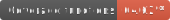

 

  
  <h3 align="center">Linguagem Delégua</h3>

  

    Linguagem de programação 100% em português com suporte a múltiplos dialetos, como Portugol VisuAlg, Portugol Studio, Mapler e BIRL.</a>
  

  

    <a href="https://designliquido.github.io/delegua-web/" target="_blank">Página Web com Interpretador Delégua para demonstrações</a>
  

  

    
    
    
    
    
    
    
    
    
    
  

  

    Acompanhe a Design Líquido nas redes sociais:
  

  

    
    
    
    
    
  

## Introdução

Delégua é uma linguagem de programação baseada na língua portuguesa, cujo código começou como uma variação (_fork_) da [linguagem Égua](https://egua.tech), usada para fins educacionais e comerciais pela Design Líquido. A variação começou na versão 1.2.0 de Égua.

Delégua tem retrocompatibilidade com a linguagem Égua e compreende sua extensão de arquivo (`.egua`). Em outras palavras, todo programa escrito em Égua funciona em Delégua, mas Delégua tem capacidades a mais, [conforme mencionado em documentação](https://github.com/DesignLiquido/delegua/wiki).

## Características

- **Simples e Completa.** Podendo ser usada por pessoas com ou sem experiência em programação.
- **Totalmente em Português.** Desenvolvida totalmente em português (mesmo) para quebrar a barreira do inglês.
- **Grátis.** Sem planos, sem limitações e sem propaganda. A licença é MIT.
- **Código aberto (_open source_).** Todo o código fonte disponível para estudar, modificar e contribuir. Usamos 100% TypeScript. As gramáticas são escritas em ANTLR4.
- **Linguagem Científica.** Apoiamos e encorajamos o desenvolvimento e aprimoramento da ciência e da educação. Temos diferentes pacotes e bibliotecas para física, matemática, etc.
- **Modular.** Escreva múltiplos fontes e os reuse em seu código.
- **Orientada a Objetos.** Classes, objetos e herança são implementados em Delégua e Pituguês.
- **Multidialetos.** Execute algoritmos em [Portugol VisuAlg](http://visualg3.com.br), [Portugol Studio](http://lite.acad.univali.br/portugol/), [Portugol Mapler](https://portugol.sourceforge.io/) e [Portugol IPT](http://orion.ipt.pt/~manso/Portugol/menuEsquerda.html). 
- **Depurável.** Usando um editor com suporte à depuração como o [Visual Studio Code](https://code.visualstudio.com), você pode inspecionar o seu programa, suas variáveis e executar linha por linha.
- **Portável.** Escreva sua aplicação e coloque Delégua dentro dela. Funciona em qualquer sistema operacional e qualquer navegador de internet.
- **Traduzível.** Traduza de Delégua para Python ou JavaScript, ou ainda de Python ou JavaScript para Delégua.

## Aplicações

- [Escrita de aplicações para Internet, usando o ferramentário (_framework_) liquido](https://github.com/DesignLiquido/liquido);
- [Aplicações em React Native](https://github.com/0thigs/StarDust).

## Instalação

Delégua executa em qualquer dispositivo que interprete JavaScript, ou seja, computadores, celulares e tablets. Você não precisa instalar nada se não quiser. Utilize uma das seguintes opções: 

- [Dentro do Visual Studio Code, instale a extensão da Design Líquido](https://marketplace.visualstudio.com/items?itemName=designliquido.designliquido-vscode). [Aprenda como executar e depurar seu programa aqui](https://www.youtube.com/watch?v=TQxLekzvBv8);
- [Utilize nosso editor online](https://designliquido.github.io/delegua-web/).

Para instalar no seu computador, veja o projeto [`@designliquido/delegua-node`](https://github.com/DesignLiquido/delegua-node). 

## Documentação

- [Delégua é documentada na Wiki deste GitHub](https://github.com/DesignLiquido/delegua/wiki).
- [A documentação técnica (gerada por TypeDoc) pode ser encontrada aqui](https://designliquido.github.io/delegua/).

## Contribuições e Comunidade

* Para contribuições, por favor, leia o nosso [Guia de Contribuição](.github/CONTRIBUTING.md) antes de submeter uma _Pull Request_.
* [Veja nossas discussões atuais](https://github.com/DesignLiquido/delegua/discussions).
* [Temos um grupo no Discord](https://discord.gg/4tBxWSSbdV).
